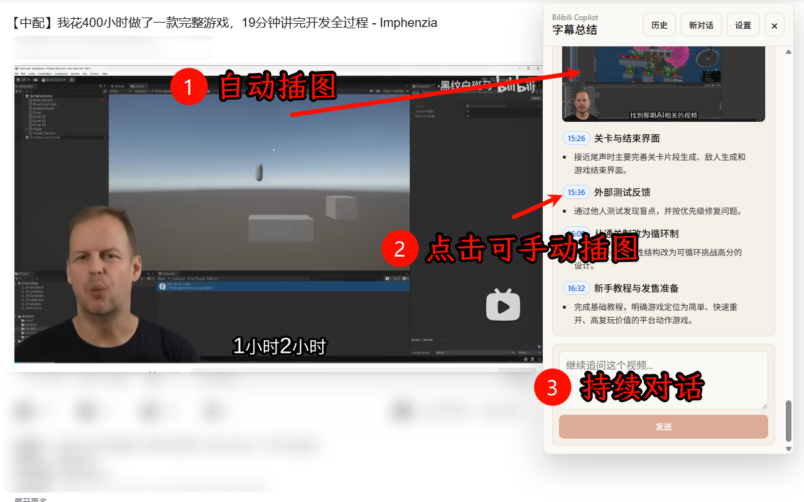

# [bilibili-copilot](https://github.com/lingkuma/bilibili-copilot)


<p align="center">
  
</p>

Bilibili Copilot is a browser extension for summarizing Bilibili videos with an AI provider. It reads subtitles from the current Bilibili video page, sends them to an OpenAI-compatible Chat Completions API, and renders the result as structured Markdown.


<p align="center">
  
</p>


## Features

- **AI summaries, ongoing conversation**
- **Timestamp interaction**
- **Key scene illustrations**
- **Local export**
- **Telegraph/tg bot sharing**

## Requirements

- Node.js
- npm
- A Chromium-based browser for local extension testing
- A Bilibili video with available subtitles
- An OpenAI-compatible API key and endpoint

## Development

Install dependencies:

```bash
npm install
```

Run the extension in development mode:

```bash
npm run dev
```

Build the Chrome MV3 extension:

```bash
npm run build
```

Run type and Svelte checks:

```bash
npm run check
```

Create a distributable zip:

```bash
npm run zip
```

## Loading The Extension

1. Run `npm run build`.
2. Open `chrome://extensions`.
3. Enable Developer mode.
4. Click "Load unpacked".
5. Select `.output/chrome-mv3`.

## Usage

1. Open a Bilibili video page.
2. Open the Bilibili Copilot overlay or popup.
3. Configure your AI provider settings.
4. Fetch subtitles and generate a summary.
5. Export the summary locally or share it to Telegraph.

## Limitations

- Videos must have accessible subtitles.
- Telegraph sharing requires Cloudinary credentials when summary images are included.

## Tech Stack

- WXT
- Svelte
- TypeScript
- Chrome Extension Manifest V3
