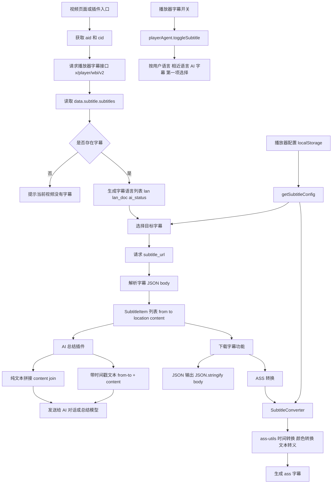

---


下面是我从项目中整理出的 **Bilibili 字幕获取与处理核心逻辑文档**，可作为你后续开发「Bilibili 字幕总结 AI 对话插件」的复用参考。
很好，我已经把它写在本地了。

请你在顶部帮我插一下那个 Mermaid 架构图，让我一眼就能看清楚整体的思路。
整理思路：本项目的字幕逻辑主要集中在「下载字幕」组件中，核心链路是：通过 `aid + cid` 调用 B 站播放器接口获取字幕列表 → 选择目标语言字幕 → 请求 `subtitle_url` 下载 BCC/JSON 字幕体 → 按需转换为 JSON 或 ASS 格式。另有播放器层的字幕开关逻辑可复用。

---

# Bilibili 字幕获取与处理可复用文档

## 1. 相关文件总览

| 文件 | 作用 |
|---|---|
| `registry/lib/components/video/subtitle/download/utils.ts` | 字幕获取、字幕下载、字幕配置读取的核心工具函数 |
| `registry/lib/components/video/subtitle/subtitle-converter.ts` | B站字幕 JSON/BCC 转 ASS 的核心转换器 |
| `src/components/video/ass-utils.ts` | ASS 格式辅助函数：颜色、时间、文本转义 |
| `registry/lib/components/video/subtitle/download/DownloadSubtitle.vue` | 下载字幕小组件，包含语言列表、JSON/ASS 下载入口 |
| `registry/lib/components/video/subtitle/download/index.ts` | 将字幕下载集成进“下载视频”资产系统 |
| `registry/lib/components/video/subtitle/download/Plugin.vue` | 下载视频插件中的字幕格式配置 |
| `src/components/video/player-agent/base.ts` | 播放器字幕开关、字幕语言选择逻辑 |
| `registry/lib/plugins/utils/keymap-toggle-subtitle/index.ts` | 快捷键开关 CC 字幕插件 |

---

# 2. 核心字幕 API

## 2.1 字幕列表接口

项目中使用的核心接口是：

```ts
https://api.bilibili.com/x/player/wbi/v2?aid=${aid}&cid=${cid}
```

调用位置：

```ts
registry/lib/components/video/subtitle/download/utils.ts
```

核心代码：

```ts
export const getSubtitleList = async (aid: string, cid: string | number) => {
  const data = await bilibiliApi(
    getJsonWithCredentials(`https://api.bilibili.com/x/player/wbi/v2?aid=${aid}&cid=${cid}`),
  )
  return lodash.get(data, 'subtitle.subtitles', []) as SubtitleInfo[]
}
```

### 返回路径

字幕列表位于接口返回数据的：

```ts
data.subtitle.subtitles
```

项目中使用：

```ts
lodash.get(data, 'subtitle.subtitles', [])
```

---

# 3. 字幕列表数据结构

项目定义的字幕信息类型如下：

```ts
export interface SubtitleInfo {
  id: number
  id_str: string
  lan: string
  lan_doc: string
  is_lock: boolean
  subtitle_url: string
  type: number
  ai_type: number
  ai_status: number
}
```

字段说明：

| 字段 | 含义 |
|---|---|
| `id` | 字幕 ID，数字形式 |
| `id_str` | 字幕 ID，字符串形式，适合排序或避免大整数精度问题 |
| `lan` | 字幕语言代码，例如 `zh-CN`、`en-US`、`ai-zh` 等 |
| `lan_doc` | 字幕语言展示名，例如 `中文（自动生成）`、`英语` |
| `is_lock` | 是否锁定 |
| `subtitle_url` | 字幕下载地址 |
| `type` | 字幕类型 |
| `ai_type` | AI 字幕类型 |
| `ai_status` | AI 字幕状态，项目中用它判断是否展示 `(AI)` |

---

# 4. 获取字幕列表

## 4.1 最小可复用版本

如果你在新插件中只需要拿字幕列表，可以抽出如下代码：

```ts
import { bilibiliApi, getJsonWithCredentials } from '@/core/ajax'

export interface SubtitleInfo {
  id: number
  id_str: string
  lan: string
  lan_doc: string
  is_lock: boolean
  subtitle_url: string
  type: number
  ai_type: number
  ai_status: number
}

export const getSubtitleList = async (aid: string, cid: string | number) => {
  const data = await bilibiliApi(
    getJsonWithCredentials(`https://api.bilibili.com/x/player/wbi/v2?aid=${aid}&cid=${cid}`),
  )

  return lodash.get(data, 'subtitle.subtitles', []) as SubtitleInfo[]
}
```

## 4.2 使用示例

```ts
const aid = unsafeWindow.aid
const cid = unsafeWindow.cid

const subtitles = await getSubtitleList(aid, cid)

if (subtitles.length === 0) {
  console.log('当前视频没有字幕')
} else {
  console.log('字幕列表:', subtitles)
}
```

---

# 5. 字幕语言列表处理

在 `DownloadSubtitle.vue` 中，项目将字幕列表转成下拉菜单选项。

核心代码：

```ts
const getSubtitleLanguageOptions = async () => {
  const subtitles = await getSubtitleList(unsafeWindow.aid, unsafeWindow.cid)
  return subtitles.toSorted(ascendingBigIntSort(it => it.id_str)).map(subtitle => {
    const displayName = subtitle.ai_status !== 0 ? `${subtitle.lan_doc} (AI)` : subtitle.lan_doc
    return {
      displayName,
      name: subtitle.lan,
    }
  })
}
```

逻辑说明：

1. 调用 `getSubtitleList(aid, cid)` 获取字幕列表。
2. 按 `id_str` 排序。
3. 转为 UI 所需结构：
   - `displayName`: 展示名称。
   - `name`: 实际语言代码。
4. 如果 `ai_status !== 0`，展示名后追加 `(AI)`。

可复用简化版：

```ts
export const getSubtitleLanguageOptions = async (aid: string, cid: string | number) => {
  const subtitles = await getSubtitleList(aid, cid)

  return subtitles
    .sort((a, b) => BigInt(a.id_str) > BigInt(b.id_str) ? 1 : -1)
    .map(subtitle => ({
      displayName: subtitle.ai_status !== 0 ? `${subtitle.lan_doc} (AI)` : subtitle.lan_doc,
      language: subtitle.lan,
      url: subtitle.subtitle_url,
      raw: subtitle,
    }))
}
```

---

# 6. 字幕下载逻辑

核心函数：

```ts
export const getSubtitleBlob = async (
  type: SubtitleDownloadType,
  input: {
    aid?: string
    cid?: string
    title?: string
    language?: string
  } = {},
) => {
  const {
    aid = unsafeWindow.aid,
    cid = unsafeWindow.cid,
    title = getFriendlyTitle(true),
    language: languageOverride,
  } = input
  if (!aid || !cid) {
    throw new Error('未找到视频 AID 和 CID')
  }
  const subtitles = await getSubtitleList(aid, cid)
  if (subtitles.length === 0) {
    Toast.info('当前视频没有字幕.', '下载字幕', 3000)
    return null
  }
  const [config, language] = await getSubtitleConfig()
  const subtitle = subtitles.find(s => s.lan === (languageOverride ?? language)) || subtitles[0]
  const json = await getJson(subtitle.subtitle_url)
  const rawData = json.body
  switch (type) {
    case 'ass': {
      const { SubtitleConverter } = await import('../subtitle-converter')
      const converter = new SubtitleConverter({ ...config, title })
      const assText = await converter.convertToAss(rawData)
      return new Blob([assText], {
        type: 'text/ass',
      })
    }
    default:
    case 'json': {
      return new Blob([JSON.stringify(rawData, undefined, 2)], {
        type: 'text/json',
      })
    }
  }
}
```

## 6.1 关键流程

```ts
aid/cid
  ↓
getSubtitleList(aid, cid)
  ↓
选择目标语言字幕
  ↓
getJson(subtitle.subtitle_url)
  ↓
取 json.body
  ↓
输出 JSON 或转换为 ASS
```

## 6.2 支持的下载格式

项目中定义：

```ts
export type SubtitleDownloadType = 'json' | 'ass'
```

即支持：

| 格式 | 说明 |
|---|---|
| `json` | 保存 B 站字幕原始 `body` 数组 |
| `ass` | 将 B 站字幕转为 ASS 字幕文本 |

---

# 7. 字幕下载地址与原始字幕结构

下载逻辑：

```ts
const json = await getJson(subtitle.subtitle_url)
const rawData = json.body
```

这说明 `subtitle_url` 返回的 JSON 里，项目只使用了 `body` 字段。

`body` 被当作如下结构处理：

```ts
export interface SubtitleItem {
  from: number
  to: number
  location: number
  content: string
}
```

字段说明：

| 字段 | 含义 |
|---|---|
| `from` | 字幕开始时间，单位秒 |
| `to` | 字幕结束时间，单位秒 |
| `location` | 字幕位置，项目转换 ASS 时未直接使用该字段，而是统一使用配置中的位置 |
| `content` | 字幕文本内容 |

实际转换中：

```ts
const [startTime, endTime] = convertTimeByEndTime(s.from, s.to)
```

说明 B 站字幕中的 `to` 是结束时间，不是持续时间。

---

# 8. 下载 JSON 字幕

项目中的 JSON 下载逻辑：

```ts
return new Blob([JSON.stringify(rawData, undefined, 2)], {
  type: 'text/json',
})
```

简化为 AI 插件可用的函数：

```ts
import { getJson } from '@/core/ajax'

export const downloadSubtitleJson = async (subtitleUrl: string) => {
  const json = await getJson(subtitleUrl)
  return json.body as SubtitleItem[]
}
```

如果你只是做 AI 总结，其实不需要生成 `Blob`，直接拿 `body` 即可。

---

# 9. 下载并提取纯文本字幕，用于 AI 总结

你的「字幕总结 AI 对话插件」最实用的复用函数可以写成这样：

```ts
export interface SubtitleItem {
  from: number
  to: number
  location: number
  content: string
}

export const getSubtitleText = async (
  aid: string,
  cid: string | number,
  language?: string,
) => {
  const subtitles = await getSubtitleList(aid, cid)

  if (subtitles.length === 0) {
    return ''
  }

  const subtitle = subtitles.find(s => s.lan === language) || subtitles[0]
  const json = await getJson(subtitle.subtitle_url)
  const body = json.body as SubtitleItem[]

  return body.map(item => item.content).join('\n')
}
```

如果你想保留时间戳，方便 AI 根据时间段总结：

```ts
export const getSubtitleTextWithTimestamp = async (
  aid: string,
  cid: string | number,
  language?: string,
) => {
  const subtitles = await getSubtitleList(aid, cid)

  if (subtitles.length === 0) {
    return ''
  }

  const subtitle = subtitles.find(s => s.lan === language) || subtitles[0]
  const json = await getJson(subtitle.subtitle_url)
  const body = json.body as SubtitleItem[]

  return body
    .map(item => `[${item.from.toFixed(2)} - ${item.to.toFixed(2)}] ${item.content}`)
    .join('\n')
}
```

---

# 10. ASS 字幕转换器

核心文件：

```ts
registry/lib/components/video/subtitle/subtitle-converter.ts
```

## 10.1 字幕位置定义

```ts
export const SubtitleLocation = {
  TopLeft: 7,
  TopCenter: 8,
  TopRight: 9,
  BottomLeft: 1,
  BottomCenter: 2,
  BottomRight: 3,
}
```

这些数值对应 ASS 的 `Alignment` 字段。

## 10.2 字幕大小定义

```ts
export enum SubtitleSize {
  VerySmall = 1,
  Small,
  Medium,
  Large,
  VeryLarge,
}
```

## 10.3 转换配置

```ts
export interface SubtitleConverterConfig {
  title: string
  width: number
  height: number
  color: string
  size: number
  opacity: number
  location: number
  boxPadding: number
  boxMargin: number
}
```

## 10.4 字幕项结构

```ts
export interface SubtitleItem {
  from: number
  to: number
  location: number
  content: string
}
```

## 10.5 ASS 转换核心类

```ts
export class SubtitleConverter {
  static defaultConfig: SubtitleConverterConfig
  config: SubtitleConverterConfig

  constructor(config: {
    title: string
    width: number
    height: number
    color?: string
    size?: number
    opacity?: number
    location?: number
    boxPadding?: number
    boxMargin?: number
  }) {
    this.config = Object.assign(SubtitleConverter.defaultConfig, config)
  }

  private async getAssMeta() {
    const { convertHexColorForStyle } = await import('@/components/video/ass-utils')
    const color = convertHexColorForStyle(this.config.color)
    const background = convertHexColorForStyle('#000000', this.config.opacity)
    const fontStyles = []
    const fontSize = ((10 * (this.config.size - 3) + 48) * this.config.height) / 720

    for (const [name, value] of Object.entries(SubtitleLocation)) {
      fontStyles.push(
        `Style: ${name},微软雅黑,${fontSize},${color},${color},${background},${background},0,0,0,0,100,100,0,0,3,${this.config.boxPadding},0,${value},${this.config.boxMargin},${this.config.boxMargin},${this.config.boxMargin},0`,
      )
    }

    return `
[Script Info]
; Script generated by Bilibili Evolved Danmaku Converter
; https://github.com/the1812/Bilibili-Evolved/
Title: ${this.config.title}
ScriptType: v4.00+
PlayResX: ${this.config.width}
PlayResY: ${this.config.height}
Timer: 10.0000
WrapStyle: 0
ScaledBorderAndShadow: no

[V4+ Styles]
Format: Name, Fontname, Fontsize, PrimaryColour, SecondaryColour, OutlineColour, BackColour, Bold, Italic, Underline, StrikeOut, ScaleX, ScaleY, Spacing, Angle, BorderStyle, Outline, Shadow, Alignment, MarginL, MarginR, MarginV, Encoding
${fontStyles.join('\n')}

[Events]
Format: Layer, Start, End, Style, Name, MarginL, MarginR, MarginV, Effect, Text`.trim()
  }

  async convertToAss(subtitles: SubtitleItem[]) {
    const { convertTimeByEndTime, normalizeContent } = await import('@/components/video/ass-utils')
    const meta = await this.getAssMeta()
    return `${meta}\n${subtitles
      .map(s => {
        const [startTime, endTime] = convertTimeByEndTime(s.from, s.to)
        const dialogue = `Dialogue: 0,${startTime},${endTime},${getLocationName(
          this.config.location,
        )},,0,0,0,,${normalizeContent(s.content)}`
        return dialogue
      })
      .join('\n')}`
  }
}
```

默认配置：

```ts
SubtitleConverter.defaultConfig = {
  title: '',
  color: '#ffffff',
  width: 1920,
  height: 1080,
  size: SubtitleSize.Medium,
  opacity: 0.5,
  location: SubtitleLocation.BottomCenter,
  boxPadding: 1,
  boxMargin: 32,
}
```

---

# 11. ASS 工具函数

核心文件：

```ts
src/components/video/ass-utils.ts
```

## 11.1 颜色转换

ASS 颜色格式为：

```ts
&HAA BB GG RR
```

项目中将网页常见的 `#RRGGBB` 转为 ASS 所需的 `BBGGRR`。

```ts
const parseHexColor = (hexColor: string) => {
  if (hexColor.startsWith('#')) {
    hexColor = hexColor.substring(1)
  }
  const red = hexColor.substring(0, 2)
  const green = hexColor.substring(2, 4)
  const blue = hexColor.substring(4, 6)
  return {
    red,
    green,
    blue,
  }
}
```

Dialogue 行内颜色：

```ts
export const convertHexColorForDialogue = (hexColor: string) => {
  const { red, green, blue } = parseHexColor(hexColor)
  const hex = `${blue}${green}${red}`.toUpperCase()
  return `\\c&H${hex}&`
}
```

Style 颜色：

```ts
export const convertHexColorForStyle = (hexColor: string, opacity = 1) => {
  const { red, green, blue } = parseHexColor(hexColor)
  const hexOpacity = Math.round(255 * (1 - opacity))
    .toString(16)
    .padStart(2, '0')
  return `&H${hexOpacity}${blue}${green}${red}`.toUpperCase()
}
```

## 11.2 时间转换

```ts
const round = (number: number) => {
  const [integer, decimal = '00'] = String(number).split('.')
  return `${integer.padStart(2, '0')}.${decimal.substring(0, 2).padEnd(2, '0')}`
}

const secondsToTime = (seconds: number) => {
  let hours = 0
  let minutes = 0
  while (seconds >= 60) {
    seconds -= 60
    minutes++
  }
  while (minutes >= 60) {
    minutes -= 60
    hours++
  }
  return `${hours}:${String(minutes).padStart(2, '0')}:${round(seconds)}`
}
```

按持续时间转换：

```ts
export const convertTimeByDuration = (startTime: number, duration: number) => [
  secondsToTime(startTime),
  secondsToTime(startTime + duration),
]
```

按结束时间转换：

```ts
export const convertTimeByEndTime = (startTime: number, endTime: number) => [
  secondsToTime(startTime),
  secondsToTime(endTime),
]
```

B 站字幕使用的是：

```ts
convertTimeByEndTime(s.from, s.to)
```

## 11.3 字幕文本转义

```ts
export const normalizeContent = (content: string) => {
  const map = {
    '{': '｛',
    '}': '｝',
    '&amp;': '&',
    '&lt;': '<',
    '&gt;': '>',
    '&quot;': '"',
    '&apos;': "'",
    '\n': '\\N',
  }
  for (const [key, value] of Object.entries(map)) {
    content = content.replace(new RegExp(key, 'g'), value)
  }
  return content
}
```

注意：

- `{`、`}` 会被替换成全角，避免 ASS 控制标签冲突。
- `\n` 会被替换成 `\N`，这是 ASS 中的换行。
- HTML 实体会被反转义。

---

# 12. 字幕设置读取逻辑

项目会读取播放器字幕设置，用于 ASS 样式配置和默认语言选择。

核心类型：

```ts
export interface SubtitleSettings {
  bilingual: boolean
  color: string
  fade: boolean
  fontsize: string
  lan: string
  opacity: number
  position: string
  scale: boolean
  shadow: string
}
```

读取函数：

```ts
export const getSubtitleConfig = async (): Promise<[SubtitleConverterConfig, string]> => {
  const { SubtitleConverter, SubtitleSize, SubtitleLocation } = await import(
    '../subtitle-converter'
  )
  const { playerAgent } = await import('@/components/video/player-agent')
  const subtitleSettings = playerAgent.getPlayerConfig<null, SubtitleSettings>('subtitle', null)

  if (!subtitleSettings) {
    return [SubtitleConverter.defaultConfig, '']
  }

  const language = subtitleSettings.lan
  const title = getFriendlyTitle(true)

  const fontSizeMapping: { [key: number]: number } = {
    0.6: SubtitleSize.VerySmall,
    0.8: SubtitleSize.Small,
    1: SubtitleSize.Medium,
    1.3: SubtitleSize.Large,
    1.6: SubtitleSize.VeryLarge,
  }

  const size = fontSizeMapping[subtitleSettings.fontsize]
  const color = parseInt(subtitleSettings.color).toString(16)
  const { opacity } = subtitleSettings

  const positions = {
    bc: SubtitleLocation.BottomCenter,
    bl: SubtitleLocation.BottomLeft,
    br: SubtitleLocation.BottomRight,
    tc: SubtitleLocation.TopCenter,
    tl: SubtitleLocation.TopLeft,
    tr: SubtitleLocation.TopRight,
    'bottom-center': SubtitleLocation.BottomCenter,
    'bottom-left': SubtitleLocation.BottomLeft,
    'bottom-right': SubtitleLocation.BottomRight,
    'top-center': SubtitleLocation.TopCenter,
    'top-left': SubtitleLocation.TopLeft,
    'top-right': SubtitleLocation.TopRight,
  }

  const subtitleLocation = positions[subtitleSettings.position]

  const video = playerAgent.query.video.element.sync() as HTMLVideoElement

  const config: SubtitleConverterConfig = {
    title,
    height: video.videoHeight,
    width: video.videoWidth,
    color,
    location: subtitleLocation,
    opacity,
    size,
    boxPadding: 1,
    boxMargin: 32,
  }

  return [config, language]
}
```

配置来源：

```ts
playerAgent.getPlayerConfig('subtitle', null)
```

底层读取：

```ts
getPlayerConfig<DefaultValueType = unknown, ValueType = DefaultValueType>(
  target: string,
  defaultValue?: DefaultValueType,
): ValueType | DefaultValueType {
  const storageKey = this.isBpxPlayer ? 'bpx_player_profile' : 'bilibili_player_settings'
  return lodash.get(JSON.parse(localStorage.getItem(storageKey)), target, defaultValue)
}
```

也就是说字幕设置存在 localStorage：

| 播放器 | storage key |
|---|---|
| BPX 新播放器 | `bpx_player_profile` |
| 旧播放器 | `bilibili_player_settings` |

---

# 13. 字幕下载 UI 逻辑

核心文件：

```ts
registry/lib/components/video/subtitle/download/DownloadSubtitle.vue
```

UI 支持：

- 展开字幕下载面板。
- 选择字幕语言。
- 下载 JSON。
- 下载 ASS。

核心代码：

```ts
const folded = ref(true)
const disabled = ref(false)
const subtitleLanguageOptions = ref<LanguageOption[]>([])
const selectedLanguage = ref<LanguageOption | undefined>(undefined)
```

初始化语言：

```ts
Promise.all([getSubtitleLanguageOptions(), getSubtitleConfig()]).then(([options, [, language]]) => {
  subtitleLanguageOptions.value = options
  const matchOption = options.find(option => option.name === language)
  if (matchOption !== undefined) {
    selectedLanguage.value = matchOption
  }
})
```

展开面板时检查是否有字幕：

```ts
const expandDownloadOptions = () => {
  if (subtitleLanguageOptions.value.length === 0) {
    Toast.info('当前视频没有字幕.', '下载字幕', 3000)
    return
  }
  folded.value = false
}
```

下载：

```ts
const download = async (type: SubtitleDownloadType) => {
  try {
    disabled.value = true
    const blob = await getSubtitleBlob(type, { language: selectedLanguage.value?.name })
    if (blob === null) {
      return
    }
    DownloadPackage.single(`${getFriendlyTitle(true)}.${type}`, blob)
  } catch (error) {
    logError(error)
  } finally {
    disabled.value = false
  }
}
```

---

# 14. 批量视频下载中的字幕集成

文件：

```ts
registry/lib/components/video/subtitle/download/index.ts
```

项目将字幕作为 `downloadVideo.assets` 的一个资产类型注册进去。

核心代码：

```ts
addData('downloadVideo.assets', async (assets: DownloadVideoAssets[]) => {
  assets.push({
    name: 'downloadSubtitles',
    displayName: '下载字幕',
    getAssets: async (
      infos,
      instance: {
        type: SubtitleDownloadType
        enabled: boolean
      },
    ) => {
      const { type, enabled } = instance
      if (!enabled) {
        return []
      }

      const toast = Toast.info('获取字幕中...', '下载字幕')
      let downloadedItemCount = 0

      const results = await Promise.allSettled(
        infos.map(async info => {
          const blob = await getSubtitleBlob(type, info.input)
          downloadedItemCount++
          toast.message = `获取字幕中... (${downloadedItemCount}/${infos.length})`
          return {
            name: `${info.input.title}.${type}`,
            data: blob,
          }
        }),
      )

      const success = results.filter(
        it => it.status === 'fulfilled',
      ) as PromiseFulfilledResult<PackageEntry>[]

      const fail = results.filter(it => it.status === 'rejected') as PromiseRejectedResult[]

      toast.message = `获取完成. 成功 ${success.length} 个, 失败 ${fail.length} 个.`

      return success.map(it => it.value)
    },
    component: () => import('./Plugin.vue').then(m => m.default),
  })
})
```

这段可以用于多 P 视频或批量视频的字幕抓取。

---

# 15. 下载视频插件中的字幕格式配置

文件：

```ts
registry/lib/components/video/subtitle/download/Plugin.vue
```

配置项：

```ts
interface Options {
  subtitleType: SubtitleDownloadType | '无'
}
```

下拉选项：

```ts
items: ['无', 'ass', 'json']
```

是否启用：

```ts
enabled() {
  return this.type !== '无'
}
```

保存用户选择：

```ts
watch: {
  type(newValue: SubtitleDownloadType) {
    options.subtitleType = newValue
  },
}
```

---

# 16. 播放器字幕开关逻辑

虽然这不是字幕下载，但对字幕插件也有参考价值。

文件：

```ts
src/components/video/player-agent/base.ts
```

核心函数：

```ts
toggleSubtitle(): PlayerAgentToggleSubtitleResult {
  const closeSwitch = dq('.bpx-player-ctrl-subtitle-close-switch') as HTMLDivElement | null

  const isNoSubtitleConfigured = !closeSwitch
  if (isNoSubtitleConfigured) {
    return {
      element: null,
      result: 'no-subtitle-configured',
    }
  }

  const isSubtitleDisabled = closeSwitch?.classList.contains('bpx-state-active')
  if (!isSubtitleDisabled) {
    closeSwitch?.click()
    return {
      element: closeSwitch,
      result: 'success',
    }
  }

  const subtitleOptions = dqa(
    '.bpx-player-ctrl-subtitle-major .bpx-player-ctrl-subtitle-language-item',
  ) as HTMLDivElement[]

  if ((subtitleOptions?.length ?? 0) === 0) {
    return {
      element: null,
      result: 'no-subtitle-configured',
    }
  }

  const subtitleLanguage = this.getPlayerConfig<null, string>('subtitle.lan', null)

  if (subtitleLanguage === null) {
    const firstOption = subtitleOptions.at(0)
    firstOption?.click()
    return {
      element: firstOption,
      result: 'success',
    }
  }

  const matchers = [
    () => subtitleOptions.find(it => it.dataset.lan === subtitleLanguage),
    () =>
      subtitleOptions.find(
        it =>
          !it.dataset.lan?.startsWith('ai-') &&
          it.dataset.lan?.includes(subtitleLanguage.split('-')[0]),
      ),
    () => subtitleOptions.find(it => it.dataset.lan === `ai-${subtitleLanguage.split('-')[0]}`),
    () => subtitleOptions.at(0),
  ]

  const option = matchers.map(match => match()).find(Boolean)

  if (!option) {
    return {
      element: null,
      result: 'no-subtitle-configured',
    }
  }

  option.click()
  return {
    element: option,
    result: 'success',
  }
}
```

## 16.1 字幕语言选择优先级

当字幕关闭，执行打开字幕时，项目的选择策略是：

1. 优先选择用户上次使用的语言：

```ts
it.dataset.lan === subtitleLanguage
```

2. 其次选择非 AI，且语言代码相近的字幕：

```ts
!it.dataset.lan?.startsWith('ai-') &&
it.dataset.lan?.includes(subtitleLanguage.split('-')[0])
```

3. 再选择 AI 字幕：

```ts
it.dataset.lan === `ai-${subtitleLanguage.split('-')[0]}`
```

4. 最后选择第一个字幕选项：

```ts
subtitleOptions.at(0)
```

---

# 17. 快捷键开关 CC 字幕

文件：

```ts
registry/lib/plugins/utils/keymap-toggle-subtitle/index.ts
```

核心代码：

```ts
actions.toggleSubtitle = {
  displayName: '开关 CC 字幕',
  run: async ({ showTip }) => {
    const { result } = playerAgent.toggleSubtitle()
    if (result === 'no-subtitle-configured') {
      showTip('当前视频没有可选字幕', 'mdi-subtitles')
    }
  },
}
```

默认快捷键：

```ts
presetBase.toggleSubtitle = 'shift c'
builtInPresets.YouTube.toggleSubtitle = 'c'
builtInPresets.PotPlayer.toggleSubtitle = 'alt h'
```

---

# 18. 为 AI 字幕总结插件推荐的封装

如果你要开发的是「字幕总结 AI 对话插件」，核心其实不需要 ASS，也不需要 Blob 下载。建议封装成下面几个函数。

## 18.1 获取字幕列表

```ts
import { bilibiliApi, getJson, getJsonWithCredentials } from '@/core/ajax'

export interface SubtitleInfo {
  id: number
  id_str: string
  lan: string
  lan_doc: string
  is_lock: boolean
  subtitle_url: string
  type: number
  ai_type: number
  ai_status: number
}

export interface SubtitleItem {
  from: number
  to: number
  location: number
  content: string
}

export const getBilibiliSubtitleList = async (aid: string, cid: string | number) => {
  const data = await bilibiliApi(
    getJsonWithCredentials(`https://api.bilibili.com/x/player/wbi/v2?aid=${aid}&cid=${cid}`),
  )

  return lodash.get(data, 'subtitle.subtitles', []) as SubtitleInfo[]
}
```

## 18.2 下载某个字幕 URL

```ts
export const getBilibiliSubtitleBody = async (subtitleUrl: string) => {
  const json = await getJson(subtitleUrl)
  return json.body as SubtitleItem[]
}
```

## 18.3 获取指定语言字幕

```ts
export const getBilibiliSubtitleByLanguage = async (
  aid: string,
  cid: string | number,
  language?: string,
) => {
  const subtitles = await getBilibiliSubtitleList(aid, cid)

  if (subtitles.length === 0) {
    return null
  }

  const subtitle = subtitles.find(it => it.lan === language) || subtitles[0]
  const body = await getBilibiliSubtitleBody(subtitle.subtitle_url)

  return {
    info: subtitle,
    body,
  }
}
```

## 18.4 提取纯文本

```ts
export const getBilibiliSubtitlePlainText = async (
  aid: string,
  cid: string | number,
  language?: string,
) => {
  const result = await getBilibiliSubtitleByLanguage(aid, cid, language)

  if (!result) {
    return ''
  }

  return result.body.map(it => it.content).join('\n')
}
```

## 18.5 提取带时间戳文本

```ts
export const getBilibiliSubtitleTimedText = async (
  aid: string,
  cid: string | number,
  language?: string,
) => {
  const result = await getBilibiliSubtitleByLanguage(aid, cid, language)

  if (!result) {
    return ''
  }

  return result.body
    .map(it => `[${formatSeconds(it.from)} - ${formatSeconds(it.to)}] ${it.content}`)
    .join('\n')
}

const formatSeconds = (seconds: number) => {
  const h = Math.floor(seconds / 3600)
  const m = Math.floor((seconds % 3600) / 60)
  const s = Math.floor(seconds % 60)

  return `${String(h).padStart(2, '0')}:${String(m).padStart(2, '0')}:${String(s).padStart(2, '0')}`
}
```

## 18.6 面向 AI 总结的完整封装

```ts
export const getVideoSubtitleForAI = async (
  aid: string,
  cid: string | number,
  options: {
    language?: string
    withTimestamp?: boolean
  } = {},
) => {
  const { language, withTimestamp = true } = options

  const subtitles = await getBilibiliSubtitleList(aid, cid)

  if (subtitles.length === 0) {
    return {
      available: false,
      reason: '当前视频没有字幕',
      subtitles: [],
      selected: null,
      text: '',
    }
  }

  const selected = subtitles.find(it => it.lan === language) || subtitles[0]
  const body = await getBilibiliSubtitleBody(selected.subtitle_url)

  const text = withTimestamp
    ? body.map(it => `[${it.from.toFixed(2)} - ${it.to.toFixed(2)}] ${it.content}`).join('\n')
    : body.map(it => it.content).join('\n')

  return {
    available: true,
    reason: '',
    subtitles,
    selected,
    body,
    text,
  }
}
```

---

# 19. AI 插件调用示例

```ts
const aid = unsafeWindow.aid
const cid = unsafeWindow.cid

const subtitleResult = await getVideoSubtitleForAI(aid, cid, {
  language: 'zh-CN',
  withTimestamp: true,
})

if (!subtitleResult.available) {
  console.log(subtitleResult.reason)
} else {
  const prompt = `
请总结下面这段 Bilibili 视频字幕内容，要求：
1. 提炼核心观点
2. 按时间顺序列出关键段落
3. 总结适合生成标题的关键词

字幕如下：

${subtitleResult.text}
`

  console.log(prompt)
}
```

---

# 20. 需要注意的点

## 20.1 `aid` 和 `cid`

项目默认从页面全局变量取：

```ts
unsafeWindow.aid
unsafeWindow.cid
```

但如果你做多 P 或批量处理，应该传入每一集对应的 `aid/cid`。

## 20.2 字幕可能为空

项目处理方式：

```ts
if (subtitles.length === 0) {
  Toast.info('当前视频没有字幕.', '下载字幕', 3000)
  return null
}
```

AI 插件中建议返回结构化结果，而不是直接抛错。

## 20.3 默认语言选择

项目优先使用播放器配置中的语言：

```ts
const [config, language] = await getSubtitleConfig()
const subtitle = subtitles.find(s => s.lan === (languageOverride ?? language)) || subtitles[0]
```

对于 AI 插件，可以使用类似策略：

1. 用户显式指定语言。
2. 播放器当前字幕语言。
3. 中文字幕。
4. 第一个字幕。

例如：

```ts
const selected =
  subtitles.find(it => it.lan === language) ||
  subtitles.find(it => it.lan === 'zh-CN') ||
  subtitles.find(it => it.lan.startsWith('zh')) ||
  subtitles[0]
```

## 20.4 AI 字幕识别

项目中通过：

```ts
subtitle.ai_status !== 0
```

展示为：

```ts
`${subtitle.lan_doc} (AI)`
```

也可以用：

```ts
const isAI = subtitle.ai_status !== 0 || subtitle.lan.startsWith('ai-')
```

## 20.5 字幕 URL

项目直接使用：

```ts
getJson(subtitle.subtitle_url)
```

实际开发中注意：

- `subtitle_url` 可能是协议相对地址，例如 `//i0.hdslb.com/...`。
- 如果你在独立环境调用，可能需要补全：

```ts
const normalizedUrl = subtitle.subtitle_url.startsWith('//')
  ? `https:${subtitle.subtitle_url}`
  : subtitle.subtitle_url
```

---

# 21. 最小复用版代码

如果你只想快速开发 AI 字幕总结插件，下面这段基本就够用：

```ts
import { bilibiliApi, getJson, getJsonWithCredentials } from '@/core/ajax'

export interface SubtitleInfo {
  id: number
  id_str: string
  lan: string
  lan_doc: string
  is_lock: boolean
  subtitle_url: string
  type: number
  ai_type: number
  ai_status: number
}

export interface SubtitleItem {
  from: number
  to: number
  location: number
  content: string
}

export const getSubtitleList = async (aid: string, cid: string | number) => {
  const data = await bilibiliApi(
    getJsonWithCredentials(`https://api.bilibili.com/x/player/wbi/v2?aid=${aid}&cid=${cid}`),
  )

  return lodash.get(data, 'subtitle.subtitles', []) as SubtitleInfo[]
}

export const getSubtitleBody = async (subtitleUrl: string) => {
  const url = subtitleUrl.startsWith('//') ? `https:${subtitleUrl}` : subtitleUrl
  const json = await getJson(url)
  return json.body as SubtitleItem[]
}

export const getSubtitleForAI = async (
  aid: string,
  cid: string | number,
  language?: string,
) => {
  const subtitles = await getSubtitleList(aid, cid)

  if (subtitles.length === 0) {
    return null
  }

  const selected =
    subtitles.find(it => it.lan === language) ||
    subtitles.find(it => it.lan === 'zh-CN') ||
    subtitles.find(it => it.lan.startsWith('zh')) ||
    subtitles[0]

  const body = await getSubtitleBody(selected.subtitle_url)

  const text = body
    .map(it => `[${it.from.toFixed(2)} - ${it.to.toFixed(2)}] ${it.content}`)
    .join('\n')

  return {
    selected,
    subtitles,
    body,
    text,
  }
}
```

---

# 22. 总结

这个项目中，字幕相关核心逻辑可以概括为：

1. **字幕列表获取**
   通过：

   ```ts
   https://api.bilibili.com/x/player/wbi/v2?aid=${aid}&cid=${cid}
   ```

   获取：

   ```ts
   data.subtitle.subtitles
   ```

2. **字幕下载**
   从字幕列表中选择一项，读取：

   ```ts
   subtitle.subtitle_url
   ```

   然后：

   ```ts
   const json = await getJson(subtitle.subtitle_url)
   const rawData = json.body
   ```

3. **字幕格式**
   项目支持：
   - `json`
   - `ass`

4. **字幕转换**
   B 站字幕 `body` 每项包含：

   ```ts
   {
     from: number
     to: number
     location: number
     content: string
   }
   ```

   其中：
   - `from` 是开始时间。
   - `to` 是结束时间。
   - `content` 是字幕文本。

5. **AI 总结插件推荐使用方式**
   不需要 Blob，也不需要 ASS。直接拿：

   ```ts
   json.body.map(item => item.content).join('\n')
   ```

   或带时间戳：

   ```ts
   json.body.map(item => `[${item.from} - ${item.to}] ${item.content}`).join('\n')
   ```

   再送入 AI 对话模型即可。